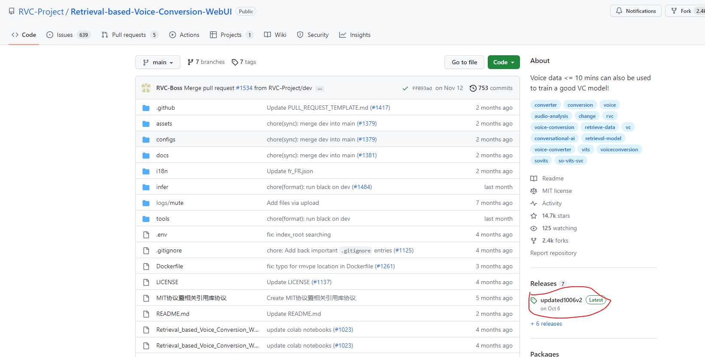

# VOICE CLONING PROJECT

### The VOICE folder contains the audio input of 5 different speakers. 
### However our bench mark dataset is LibriTTS: https://www.openslr.org/60/

# First Install AI Voice Cloning

> **Note** This project has been in dire need of being rewritten from the ground up for some time. Apologies for any crust from my rather spaghetti code.

This [repo](https://git.ecker.tech/mrq/ai-voice-cloning)/[rentry](https://rentry.org/AI-Voice-Cloning/) aims to serve as both a foolproof guide for setting up AI voice cloning tools for legitimate, local use on Windows/Linux, as well as a stepping stone for anons that genuinely want to play around with [TorToiSe](https://github.com/neonbjb/tortoise-tts).

>\>Ugh... why bother when I can just abuse 11.AI?

You're more than welcome to, but TorToiSe is shaping up to be a very promising tool, especially with finetuning now on the horizon.

This is not endorsed by [neonbjb](https://github.com/neonbjb/). I do not expect this to run into any ethical issues, as it seems (like me), this is mostly for making funny haha vidya characters say funny lines.

## Documentation

Please consult [the wiki](https://git.ecker.tech/mrq/ai-voice-cloning/wiki) for the documentation.

## Bug Reporting

If you run into any problems, please refer to the [issues you may encounter](https://git.ecker.tech/mrq/ai-voice-cloning/wiki/Issues) wiki page first.

### Until This You are Able to train and test The voices using GUI one by one.

### For Enhancement of the Voice Using RVC (Retrieval-based-Voice-Conversion-WebUI) Follow Second And Third.

## Finally For Multi-Speaker You Can Edit The AI-VOICE-CLONING repo, I will share the CODE.
YOU can move this two files: cli.py and function.py inside the src of ai-voice-cloning folder.

## Second Install RVC (Retrieval-based-Voice-Conversion-WebUI)
Download the latest one from here: Check The Below Screenshot 
https://github.com/RVC-Project/Retrieval-based-Voice-Conversion-WebUI/releases/tag/updated1006v2

Otherwise: Use this Youtube Link to Install it: https://www.youtube.com/watch?v=hB7zFyP99CY

Preparing the environment
The following commands need to be executed in the environment of Python version 3.8 or higher.

(Windows/Linux) First install the main dependencies through pip:

# Install PyTorch-related core dependencies, skip if installed
# Reference: https://pytorch.org/get-started/locally/
pip install torch torchvision torchaudio

#For Windows + Nvidia Ampere Architecture(RTX30xx), you need to specify the cuda version corresponding to pytorch according to the experience of https://github.com/RVC-Project/Retrieval-based-Voice-Conversion-WebUI/issues/21
#pip install torch torchvision torchaudio --index-url https://download.pytorch.org/whl/cu117

#For Linux + AMD Cards, you need to use the following pytorch versions:
#pip install torch torchvision torchaudio --index-url https://download.pytorch.org/whl/rocm5.4.2

You can also use pip to install them:

for Nvidia graphics cards
  pip install -r requirements.txt

for AMD/Intel graphics cards on Windows (DirectML)：
  pip install -r requirements-dml.txt

for Intel ARC graphics cards on Linux / WSL using Python 3.10: 
  pip install -r requirements-ipex.txt

for AMD graphics cards on Linux (ROCm):
  pip install -r requirements-amd.txt

  Or just download them by yourself from our Huggingface space.

Here's a list of Pre-models and other files that RVC needs:

./assets/hubert/hubert_base.pt

./assets/pretrained 

./assets/uvr5_weights

Additional downloads are required if you want to test the v2 version of the model.

./assets/pretrained_v2

If you want to test the v2 version model (the v2 version model has changed the input from the 256 dimensional feature of 9-layer Hubert+final_proj to the 768 dimensional feature of 12-layer Hubert, and has added 3 period discriminators), you will need to download additional features

./assets/pretrained_v2

#If you are using Windows, you may also need these two files, skip if FFmpeg and FFprobe are installed
ffmpeg.exe

https://huggingface.co/lj1995/VoiceConversionWebUI/blob/main/ffmpeg.exe

ffprobe.exe

https://huggingface.co/lj1995/VoiceConversionWebUI/blob/main/ffprobe.exe

If you want to use the latest SOTA RMVPE vocal pitch extraction algorithm, you need to download the RMVPE weights and place them in the RVC root directory

https://huggingface.co/lj1995/VoiceConversionWebUI/blob/main/rmvpe.pt

    For AMD/Intel graphics cards users you need download:

    https://huggingface.co/lj1995/VoiceConversionWebUI/blob/main/rmvpe.onnx

After that you can run the WebUI:

python infer-web.py

### After RVC Setup, you need an API to use BOTH TorToiSe and RVC. For the Follow Third one

### Also, After Voice Training from RVC you need to use the same model weight with respect to the speaker. NOTE: You cannot do mulitspeaker voice training in RVC. IF have to do one speaker by one speaker.
### Third, Follow this RVC-TTS-Pipeline: USE above RVC model weight here and output of tortoise tts as input in following repo.

### For Youtube Instruction: https://www.youtube.com/watch?v=MckT7z7W_qM
Pipeline for TTS to RVC. This seems to produce the best sounding TTS with the closest representation to the original speaker's voice that one may have trained on. This works by passing in an audio file generated from some type of TTS (tortoise, vits, etc.) and then converting it using the trained weights from an RVC model.

To get this to work, pytorch must be installed first on the system to allow RVC to be installable. If it's not, I was running into issues of having to uninstall and reinstall torch (though probably I should just adjust the requirements inside of rvc).

It is still a work in progress, there will be bugs and issues.

Installation
Install pytorch first here: https://pytorch.org/get-started/locally/

Then, to install rvc, run the following:

pip install -e git+https://github.com/JarodMica/rvc.git#egg=rvc
Lastly, you need to get the hubert_base.pt and rmvpe.pt files from rvc and put them into the parent directory of whatever project you're working on (or the SAME location of whereever you're running the scripts)
If you want to install rvc-tts-pipeline as it's own package, run the following (recommended)

pip install -e git+https://github.com/JarodMica/rvc-tts-pipeline.git#egg=rvc_tts_pipe
This will allow you to import rvc_infer so that you do not have to move this package around.

Basic usage
The only function that should be called is the rvc_convert function. The only required parameters that are absolutely needed are:

model_path = path to the model

input_path = path to the audio file to convert (or tts output audio file)

Then, it can simply be called like the following:

from rvc_infer import rvc_convert

rvc_convert(model_path="your_model_path_here", input_path="your_audio_path_here")
The docstrings of rvc_convert details out other values you may want to play around with, probably the most important being pitch and f0method.

